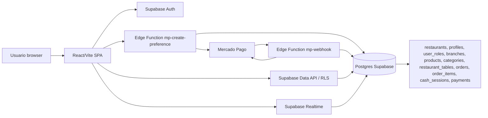

# Auditoría Arquitectónica Integral — RestoCloud

Fecha: 2026-06-25  
Rol: Staff Software Architect / Solution Architect / Technical Auditor  
Alcance revisado: `docs`, `src`, `supabase`, configuración Vite/Vitest/ESLint, dependencias y scripts npm. No existen `apps`, `services`, `packages`, `backend`, `frontend`, `infra`, `docker`, `.github`, `terraform`, `k8s` ni `scripts` en el árbol versionado.

## 1. Executive Summary

RestoCloud implementa una SPA React/Vite con Supabase como backend administrado. La arquitectura real es un frontend monolítico por páginas, integración directa a Supabase Data API desde UI, dos Edge Functions para Mercado Pago, migraciones SQL con RLS y Realtime, y tests mínimos de Vitest.

La dirección arquitectónica documentada en los ADRs apunta a SaaS multitenant con `Restaurant = Tenant`, aislamiento por `restaurant_id`, roles RBAC, aislamiento adicional por sucursal mediante `branch_members`, acceso público QR controlado por RPC/views/security-definer, Realtime validado por tenant/sucursal/rol, Mercado Pago y observabilidad. La implementación cumple parcialmente la base multitenant y parte de RLS, pero todavía contradice o deja incompletos varios puntos relevantes.

Hallazgos principales:

- Los ADR-001, ADR-002 y ADR-003 son los únicos ADRs con contenido; ADR-004 a ADR-007 están vacíos aunque el código ya implementa QR público, Realtime, pagos Mercado Pago y caja/pagos.
- El enum real `app_role` mantiene `manager` y no incluye `general_manager` ni `branch_manager`, contradiciendo ADR-002/ADR-003.
- No existe tabla `branch_members`; el alcance por sucursal no está modelado y la autorización de roles operativos queda a nivel restaurante.
- Hay grants y policies anónimas históricas para tablas de negocio (`branches`, `categories`, `products`, `restaurant_tables`, `orders`, `order_items`). Algunas policies inseguras se dropean después, pero siguen existiendo grants y policies públicas basadas sólo en `active`/`available`, prohibidas como único mecanismo en ADR-003.
- La UI accede a tablas directamente desde páginas y mezcla presentación, aplicación y acceso a datos, lo cual acelera el MVP pero dificulta gobernanza de bounded contexts y validaciones de arquitectura.
- Realtime usa filtros por `restaurant_id` en cliente, pero la policy de `realtime.messages` sólo exige usuario autenticado; no valida tenant, branch ni rol como exige ADR-003.
- Mercado Pago está implementado para pagos de pedidos con una única credencial global `MERCADOPAGO_ACCESS_TOKEN`; ADR-001 menciona pagos propios por restaurante y suscripciones SaaS, por lo que el modelo de pagos está incompleto/documentalmente desalineado.
- La documentación técnica fuera de ADRs está prácticamente vacía y README conserva texto placeholder.
- CI/CD versionado no existe; tampoco hay Terraform, Kubernetes o Docker versionados.

Recomendación: el proyecto no está listo para escalar sin una fase previa de alineación arquitectónica. Puede continuar como MVP controlado, pero antes de crecimiento multi-tenant real se recomienda ejecutar Wave 1 y Wave 2 del roadmap.

### Scores globales

| Categoría | Score |
|---|---:|
| ADR Compliance | 48/100 |
| Architecture Consistency | 52/100 |
| Documentation Accuracy | 28/100 |
| Technical Debt | 42/100 |
| Overall Architecture Health | 43/100 |

## 2. Inventario de ADRs

| ADR | Estado | Componentes impactados |
|---|---|---|
| ADR-001 — Arquitectura Multitenant | DRAFT | Restaurantes, sucursales, productos, categorías, mesas, pedidos, pagos, caja, RLS, acceso público, Realtime, Mercado Pago |
| ADR-002 — Autenticación y Roles | DRAFT v2 | Supabase Auth, `profiles`, `user_roles`, enum `app_role`, UI de equipo, RLS, permisos por rol |
| ADR-003 — Estrategia de Aislamiento Multitenant y RLS | APPROVED | RLS, `restaurant_id`, `branch_id`, `branch_members`, policies, acceso público, Realtime, SQL migrations |
| ADR-004 — Acceso Público QR | Sin contenido | Menú público, QR, RPC de pedidos públicos, grants anon, policies públicas |
| ADR-005 — Realtime y Eventos | Sin contenido | Supabase Realtime, canales de pedidos, cocina, mesas |
| ADR-006 — Mercado Pago | Sin contenido | Edge Functions MP, pagos, webhooks, credenciales, cash sessions |
| ADR-007 — Auditoría y Observabilidad | Sin contenido | Logs, auditoría, métricas, trazabilidad, CI/CD |

### Extracción ADR por ADR

#### ADR-001
- ID: ADR-001.
- Título: Arquitectura Multitenant.
- Estado: DRAFT.
- Contexto: SaaS gastronómico con múltiples negocios sobre infraestructura compartida.
- Decisión: tenant actual = restaurante; sucursales no son tenants; clave de aislamiento `restaurant_id`; acceso público sólo por RPC/views/security-definer; Realtime aislado; posibilidad futura de `tenant_id`.
- Consecuencias: todas las entidades de negocio deben contener `restaurant_id`; disciplina estricta de RLS; no debe existir acceso público directo no filtrado a tablas de negocio.
- Componentes afectados: schema SQL, RLS, UI pública, Realtime, pagos, pedidos, caja.

#### ADR-002
- ID: ADR-002.
- Título: Autenticación y Roles.
- Estado: DRAFT v2.
- Contexto: múltiples perfiles operativos en plataforma multitenant.
- Decisión: RBAC con roles oficiales `owner`, `general_manager`, `branch_manager`, `cashier`, `waiter`, `kitchen`, `customer`; permisos vía roles; diferenciar alcance global y por sucursal.
- Consecuencias: enum y UI deben usar roles oficiales; branch managers/cajeros/mozos/cocina requieren asignación a sucursales.
- Componentes afectados: Supabase Auth, `profiles`, `user_roles`, enum `app_role`, UI de equipo, policies.

#### ADR-003
- ID: ADR-003.
- Título: Estrategia de Aislamiento Multitenant y Row Level Security.
- Estado: APPROVED.
- Contexto: riesgos de exposición por policies amplias, anon access, cross-tenant y realtime.
- Decisión: toda policy debe validar `restaurant_id` como mínimo y `branch_id` cuando aplique; prohibidas policies `USING (true)` y `USING (active = true)` como único control; `branch_members` oficial; Realtime debe validar restaurant, branch y rol.
- Consecuencias: RLS debe ser la barrera final; acceso público debe ser explícito y controlado; roles operativos deben limitarse por sucursal.
- Componentes afectados: migrations, RLS, Realtime, UI pública, orders, products, branches, tables, cash/payments.

#### ADR-004 a ADR-007
- Sin contenido extraíble: archivos vacíos. Esto es architectural drift documental porque el código contiene implementación real en esas áreas sin decisiones documentadas.

## 3. Modelo arquitectónico real

### Estructura real

```text
RestoCloud
├─ docs/                 # ADRs parciales; docs técnicas vacías
├─ src/                  # React SPA monolítica
│  ├─ pages/             # páginas públicas y app privada
│  ├─ pages/app/         # módulos UI: Dashboard, Orders, Kitchen, Cash, Menu, etc.
│  ├─ components/        # AppShell, ProtectedRoute y shadcn/ui
│  ├─ hooks/             # AuthProvider/useAuth
│  ├─ integrations/      # Supabase client y tipos generados
│  ├─ lib/               # utilidades y PDF de ticket
│  └─ test/              # setup y test mínimo
├─ supabase/
│  ├─ migrations/        # schema, RLS, realtime, cash/payments, public order RPC
│  ├─ functions/         # mp-create-preference, mp-webhook
│  └─ config.toml        # configuración de functions
├─ package.json          # scripts y dependencias npm
└─ vite/vitest/eslint    # build, test y lint local
```

### Dominios y bounded contexts reales

| Dominio / contexto | Implementación real | Observación |
|---|---|---|
| Identidad y acceso | `profiles`, `user_roles`, `app_role`, `AuthProvider`, `ProtectedRoute`, `Team` | RBAC parcial; sin roles oficiales nuevos ni branch memberships. |
| Tenant y sucursales | `restaurants`, `branches`, páginas `Settings`, `Branches` | `restaurant_id` consistente; branch isolation incompleto. |
| Catálogo | `categories`, `products`, páginas `Categories`, `Menu`, `PublicMenu` | Acceso público directo a tablas con policies/grants. |
| Mesas y QR | `restaurant_tables`, `Tables`, ruta `/m/:slug` | QR genera URL pública; ADR correspondiente vacío. |
| Pedidos y cocina | `orders`, `order_items`, `Orders`, `Kitchen`, Realtime | Realtime filtrado en cliente; política DB insuficiente para tenant/branch/role. |
| Caja y pagos | `cash_sessions`, `payments`, `Cash`, `Orders` | Uso de `is_owner_or_manager`; cajero definido en ADR no puede operar según RLS actual. |
| Mercado Pago | Edge Functions `mp-create-preference` y `mp-webhook` | Implementado como pagos de pedidos con token global, no suscripciones SaaS ni credenciales por restaurante. |
| Reportes | `Reports`, queries directas | Sin capa analítica ni boundaries. |

### Capas reales

| Capa | Encontrado | Gap arquitectónico |
|---|---|---|
| Presentation | React pages y components | Muy acoplada a Supabase. |
| Application | Lógica procedural dentro de páginas/hooks | No hay services/use-cases explícitos. |
| Domain | Tipos locales e interfaces en componentes | No hay dominio centralizado ni invariantes aisladas. |
| Infrastructure | Supabase client, migrations, Edge Functions | Infra acoplada directamente a UI. |

### Integraciones e infraestructura

- APIs: Supabase Data API desde cliente, Supabase Auth, Edge Functions, Mercado Pago REST API.
- Eventos: Supabase Realtime `postgres_changes` en `Orders` y `Kitchen`.
- Colas: no encontradas.
- Bases de datos: PostgreSQL gestionado por Supabase, schema versionado en migrations.
- Servicios externos: Mercado Pago, Google OAuth vía Supabase Auth.
- Docker/Kubernetes/Terraform: no encontrados en repositorio.
- CI/CD: no hay `.github/workflows` versionado.

### Mapa de arquitectura real



## 4. Matriz ADR → Implementación

| ADR | Estado de cumplimiento | Evidencia |
|---|---|---|
| ADR-001 | ⚠ Implementado parcialmente | `restaurants`, `branches` y entidades principales usan `restaurant_id`; RLS usa helpers de pertenencia. Contradicción parcial: grants anon directos a tablas de negocio y pagos propios por restaurante no modelados. |
| ADR-002 | 🚨 Contradicho por el código | ADR define `general_manager` y `branch_manager`; enum real tiene `manager` y no tiene esos roles. UI `Team` también usa `manager`. |
| ADR-003 | ⚠ Implementado parcialmente / 🚨 en branch isolation y público | RLS existe y varias policies validan `restaurant_id`, pero no existe `branch_members`; policies públicas basadas en `active`/`available` y Realtime no valida tenant/branch/role. |
| ADR-004 | ❌ No implementado documentalmente | Archivo vacío; código implementa `/m/:slug`, consultas públicas y RPC `create_public_order` sin ADR. |
| ADR-005 | ❌ No implementado documentalmente | Archivo vacío; código usa Realtime en Orders/Kitchen y migrations agregan tablas a publication sin ADR. |
| ADR-006 | ❌ No implementado documentalmente / ⚠ parcial en código | Archivo vacío; hay Edge Functions MP y payments, pero no decisión documentada sobre token global, webhooks, idempotencia o marketplace/credenciales por restaurante. |
| ADR-007 | ❌ No implementado | Archivo vacío; no hay tablas de auditoría, observabilidad, tracing, dashboards ni CI checks. |

## 5. Desalineaciones y architectural drift

| ID | Tipo | Evidencia | Impacto |
|---|---|---|---|
| DRIFT-001 | ADR evolucionó pero código no | Roles oficiales de ADR-002/003 incluyen `general_manager` y `branch_manager`; enum real sigue con `manager`. | Permisos inconsistentes y difícil migración futura. |
| DRIFT-002 | ADR existe pero implementación incompleta | ADR-003 exige `branch_members`; no hay migration que la cree. | Roles operativos quedan con alcance tenant completo. |
| DRIFT-003 | Código evolucionó pero ADR no | QR público, Realtime, Mercado Pago, caja y pagos tienen código; ADR-004/005/006 están vacíos. | Decisiones implícitas y riesgos no gobernados. |
| DRIFT-004 | Violación RLS pública | Policies `USING (active = true)` y `USING (available = true)` para anon en tablas de negocio. | Enumeración cross-tenant de catálogo/branches si grants permanecen. |
| DRIFT-005 | Realtime insuficiente | Policy de `realtime.messages` sólo exige `auth.uid() IS NOT NULL`. | Riesgo de suscripción no segmentada si topic/canal no controla tenant. |
| DRIFT-006 | Capas acopladas | Páginas consultan/actualizan Supabase directamente. | Lógica de negocio en UI y difícil testabilidad. |
| DRIFT-007 | Mercado Pago ambiguo | Funciones usan `MERCADOPAGO_ACCESS_TOKEN` global. | No alinea pagos propios por restaurante ni suscripciones SaaS. |
| DRIFT-008 | Gobernanza ausente | No hay CI/CD ni architecture tests. | Drift no se detecta automáticamente. |
| DRIFT-009 | Documentación obsoleta | README placeholder y docs de arquitectura vacías. | Alto costo de onboarding y baja auditabilidad. |

## 6. Gap Analysis

| Área | Esperado por ADR | Encontrado en código | Gap | Criticidad |
|---|---|---|---|---|
| Tenant isolation | `restaurant_id` obligatorio y RLS por tenant | Presente en tablas principales y policies autenticadas | Base correcta; revisar grants/policies anon | P1 Alto |
| Branch isolation | `branch_id` + `branch_members` para roles operativos | `branch_id` en tablas operativas, sin `branch_members` | No hay autorización por sucursal | P0 Crítico |
| RBAC | Roles oficiales owner/general_manager/branch_manager/cashier/waiter/kitchen/customer | Enum/UI usan owner/manager/waiter/kitchen/cashier/customer | Contradicción directa | P0 Crítico |
| Acceso público QR | RPC/views/security-definer, no acceso directo a tablas | RPC para crear pedido; lectura pública directa a restaurants/branches/categories/products/tables | Público inconsistente con ADR-001/003 | P1 Alto |
| Realtime | Validar restaurant+branch+rol | Cliente filtra restaurant; policy realtime sólo auth | Control insuficiente | P1 Alto |
| Pagos por restaurante | Pagos propios de cada restaurante + suscripciones SaaS | MP token global y pagos de pedidos | Modelo incompleto | P2 Medio |
| Observabilidad | ADR y mecanismos de auditoría | No hay implementación | Ausencia total | P2 Medio |
| CI/CD | Checks automáticos | No hay workflows | Sin enforcement | P2 Medio |
| Tests | Validar arquitectura y negocio | Un test de ejemplo | Cobertura irrelevante | P2 Medio |
| Documentación técnica | Tenant model/schema/permissions actualizados | Archivos vacíos | No confiable | P1 Alto |

## 7. Plan de alineación

### Wave 1 — Correcciones críticas

| Tarea | Archivos afectados | Complejidad | Riesgo | Estimación |
|---|---|---:|---:|---:|
| Migrar `app_role`: agregar `general_manager`, `branch_manager`, mapear `manager` | `supabase/migrations/*`, `src/pages/app/Team.tsx`, `src/hooks/useAuth.tsx` | Media | Alto | 1-2 días |
| Crear `branch_members` y helpers RLS por sucursal | nueva migration SQL, tipos Supabase | Media | Alto | 2-3 días |
| Endurecer anon access: remover grants/policies directas y exponer RPC/view pública segura | migrations, `PublicMenu.tsx` | Alta | Alto | 3-5 días |
| Rediseñar Realtime con canales/topic por tenant/branch y policies verificables | migrations, `Orders.tsx`, `Kitchen.tsx` | Media | Medio | 2-3 días |
| Bloquear operaciones de caja/pagos a roles adecuados (`cashier`, managers) con branch scope | migrations, `Cash.tsx`, `Orders.tsx` | Media | Medio | 2-4 días |

### Wave 2 — Alineación estructural

| Tarea | Archivos afectados | Complejidad | Riesgo | Estimación |
|---|---|---:|---:|---:|
| Extraer capa application/data access (`src/features/*`) | `src/pages/app/*`, nuevo `src/features` | Alta | Medio | 1-2 semanas |
| Separar bounded contexts: identity, tenant, catalog, orders, payments, reporting | `src` | Alta | Medio | 1-2 semanas |
| Generar docs reales de schema, tenant model y permissions matrix | `docs/architecture/*` | Media | Bajo | 2-3 días |
| Documentar ADR-004/005/006/007 con decisiones reales o target | `docs/adr/*` | Media | Bajo | 2-4 días |
| Introducir tests de RLS con Supabase local o pgTAP | `supabase/tests`, CI | Media | Medio | 3-5 días |

### Wave 3 — Gobernanza

#### ADR Governance

- Todo cambio que altere límites de contexto, seguridad, infraestructura, datos o integraciones requiere ADR.
- Estados recomendados: `PROPOSED`, `APPROVED`, `SUPERSEDED`, `DEPRECATED`.
- Cada ADR debe incluir: contexto, decisión, alternativas, consecuencias, componentes, fitness functions, fecha y owner.
- Los ADRs vacíos deben bloquear merge.
- Cambios de código que contradigan ADR aprobado deben incluir ADR nuevo o actualización explícita.

#### Architecture Validation

- Ejecutar validaciones de capas y dependencias en CI.
- Validar migrations para detectar `USING (true)`, anon grants a tablas de negocio y roles no oficiales.
- Validar presencia y formato de ADRs.
- Validar que features no importen infraestructura fuera de puertos/adapters cuando exista refactor.

## 8. Architecture Fitness Functions propuestas

| Fitness Function | Regla | Herramienta recomendada | CI |
|---|---|---|---|
| ADR completeness | Ningún `docs/adr/ADR-*.md` puede estar vacío; debe contener Estado/Contexto/Decisión/Consecuencias | script Node/TS o markdownlint custom | obligatorio |
| RLS unsafe policies | Fallar si migration contiene `USING (true)` o anon policy sin `restaurant_id`/RPC controlado | Semgrep/rg custom | obligatorio |
| Anon grants | Fallar si `GRANT SELECT/INSERT/UPDATE/DELETE ... TO anon` se aplica a tablas negocio no allowlisted | Semgrep/SQLFluff custom | obligatorio |
| Role consistency | Enum `app_role`, UI roles y ADR roles deben coincidir | script TS parseando SQL + constants | obligatorio |
| Branch isolation | Toda tabla operativa con `branch_id` debe tener policy/helper que valide membership | pgTAP/Supabase local tests | obligatorio |
| Layer boundaries | UI no importa `supabase` directamente luego de extraer services | dependency-cruiser / eslint-plugin-boundaries | obligatorio tras Wave 2 |
| Realtime topic isolation | Suscripciones deben incluir filtros tenant/branch y policy DB equivalente | tests unitarios + SQL tests | obligatorio |
| Edge Function security | Webhooks deben verificar firma/origen cuando proveedor lo soporte | Deno tests/Semgrep | obligatorio |
| CI hygiene | `npm run lint`, `npm test`, `npm run build` obligatorios | GitHub Actions | obligatorio |

## 9. Technical Debt Report priorizado

| ID | Deuda técnica | Prioridad | Motivo |
|---|---|---|---|
| TD-001 | RBAC inconsistente con ADR | P0 | Contradicción de seguridad/autorización. |
| TD-002 | Sin branch membership | P0 | Riesgo cross-branch para roles operativos. |
| TD-003 | Acceso público directo a tablas | P1 | Riesgo de enumeración y contradicción ADR. |
| TD-004 | Realtime sin validación tenant/branch/rol en policy | P1 | Riesgo de fuga de eventos. |
| TD-005 | ADRs vacíos para funcionalidades implementadas | P1 | Decisiones productivas no gobernadas. |
| TD-006 | UI contiene lógica de aplicación e infraestructura | P2 | Dificulta testeo, evolución y boundaries. |
| TD-007 | Tests no cubren negocio ni seguridad | P2 | No detectan regresiones. |
| TD-008 | Sin CI/CD versionado | P2 | No hay puerta automática de calidad. |
| TD-009 | README/docs placeholder | P3 | Onboarding deficiente. |

## 10. Backlog de implementación

| ID | Tarea | Prioridad | Esfuerzo |
|---|---|---|---|
| BL-001 | Definir y migrar roles oficiales en DB y UI | P0 | M |
| BL-002 | Crear `branch_members` + policies por sucursal | P0 | L |
| BL-003 | Reemplazar acceso público directo por RPC/views seguras | P1 | L |
| BL-004 | Añadir tests RLS para tenant y branch isolation | P1 | M |
| BL-005 | Rediseñar Realtime con autorización verificable | P1 | M |
| BL-006 | Completar ADR-004 Acceso Público QR | P1 | S |
| BL-007 | Completar ADR-005 Realtime y Eventos | P1 | S |
| BL-008 | Completar ADR-006 Mercado Pago | P1 | S |
| BL-009 | Completar ADR-007 Auditoría y Observabilidad | P2 | S |
| BL-010 | Añadir GitHub Actions con lint/test/build/security checks | P2 | M |
| BL-011 | Introducir dependency-cruiser o eslint boundaries | P2 | M |
| BL-012 | Refactor a `src/features/*` con data access encapsulado | P2 | XL |
| BL-013 | Documentar schema real y permissions matrix | P2 | M |
| BL-014 | Añadir auditoría de pagos y eventos críticos | P2 | M |
| BL-015 | Documentar README operativo | P3 | S |
